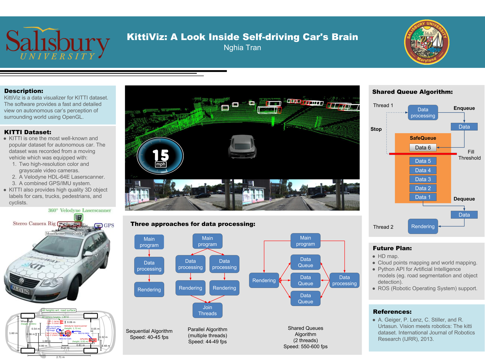

# KittiViz
Data visualizer for Kitti dataset.

This is the final project for [Dr. Spickler](http://facultyfp.salisbury.edu/despickler/personal/index.html)'s COSC482: Computer Graphics at Salisbury University spring 2017.

## Project poster



## Gif demo ([Youtube video](https://www.youtube.com/watch?v=mxfc5-9cF9o&feature=youtu.be))


## Requirements

* [Code::Blocks](http://www.codeblocks.org/)

* [Kitti dataset](http://www.cvlibs.net/datasets/kitti/raw_data.php)

* OpenGL >= 3.5

## How to compile and run it

1/ Download and extract raw data (`synced+rectified data` and `tracklets`) from [cvlibs](http://www.cvlibs.net/datasets/kitti/raw_data.php). Note that, currently, this project only works for dataset with a tracklets file. For example, KittiViz can run for `2011_09_26_drive_0001` as there is `tracklets` download link in `download` section. On the other hand, KittiViz won't run for `2011_09_26_drive_0095` as that dataset doesn't have a tracklets file.
2/ Make sure your data folder hierarchy is structured like this:
```
├── 2011_09_26
│   ├── 2011_09_26_drive_0001_sync
│   │   ├── image_00
│   │   ├── image_01
│   │   ├── image_02
│   │   ├── image_03
│   │   ├── oxts
│   │   ├── tracklet_labels.xml
│   │   └── velodyne_points
│   ├── 2011_09_26_drive_0036_sync
│   │   ├── image_00
│   │   ├── image_01
│   │   ├── image_02
│   │   ├── image_03
│   │   ├── oxts
│   │   ├── tracklets
│   │   └── velodyne_points
```

3/ From the KittiViz directory, run `parser.py path_to_tracklet_labels.xml` to create `tracklets` folder. Resulting folder tree should be like:
```
├── 2011_09_26
│   ├── 2011_09_26_drive_0001_sync
│   │   ├── image_00
│   │   ├── image_01
│   │   ├── image_02
│   │   ├── image_03
│   │   ├── oxts
│   │   ├── tracklet_labels.xml
│   │   ├── **tracklets**
│   │   └── velodyne_points
│   ├── 2011_09_26_drive_0036_sync
│   │   ├── image_00
│   │   ├── image_01
│   │   ├── image_02
│   │   ├── image_03
│   │   ├── oxts
│   │   ├── tracklet_labels.xml
│   │   ├── **tracklets**
│   │   └── velodyne_points
```

4/ Load the project in to Code::Blocks by:
* Go to `File` -> `Open`
* Click on `OBJModelLoadingCompleteStars.cbp` file. 

5/ Update these [three lines](https://github.com/nghiattran/KittiViz/blob/b80a9c6c53019d1d1a358e468ec50c134cc1f72b/lib/loaders/DataLoader.h#L52) to the dataset you want to run:
* `path`: absolute path to your kitti base folder.
* `date`: dataset's date.
* `drive`: drive number of the dataset.

For exmaple, `2011_09_26_drive_0001_sync` is the `date` it is recorded on `2011_09_26` and `1` is its `drive` number.

6/ Hit `Build and Run` button on Code:Block to compile and run it.

## Keyboards

* `P`: Pause and resume.
* `C`: Toggle drawing cloudpoints.
* `X`: Switch speed unit between `mph` and `kph`.
* `B`: Toggle drawing bounding boxes.
* `Shift` + `.` or `Shift` + `,`: Increase or decrease frame speed.
* `Up`, `Down`, `Left`, `Right`: Move camera.
* `Ctrl` + `Up` or `Ctrl` + `Down`: Zoom in and zoom out.
